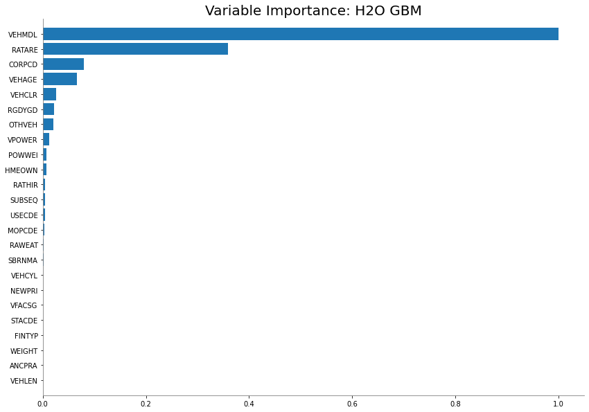
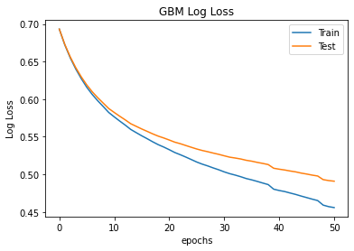
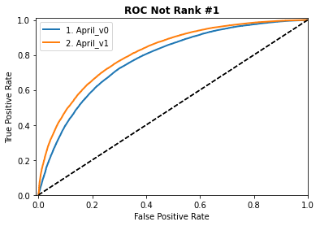
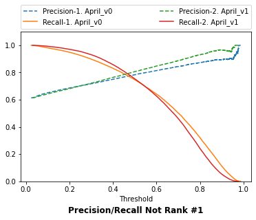

# Project Aldrin
<a name="TBC"></a>
### Table of Contents

Part I. [Folders](#section-1)  
1. [Data_Handler](/users/mleong/repos/project-aldrin/browse/Data_Handler)  
2. [scoring](/users/mleong/repos/project-aldrin/browse/scoring)
3. [my_logs](/users/mleong/repos/project-aldrin/browse/my_logs)

Part II. [Modules](#section-2)  
1. [Evaluation.py](#evaluation)
2. [Data_Explorer.py](#data-explorer)

Part III. [Notebooks](#section-3)  
1. [train.ipynb ](#train)
2. [R&D.ipynb](#RnD)	


## Overview
Project Aldrin aims to improve the competitiveness of our pricing offered on aggregator (CTM). The following repository contained the predictive model capable of estimating the likelihood of a given quote being ranked number-1 on the aggregator website and the resource needed to reproduce.

In [Part III](#section-3) consist of a jupyter-notebook - [train.ipynb](#train), which is the primary documentation of the procedure. The python environment requirement is listed in [requirements.txt](). Use `pip install -r requirements.txt` to replicate it.

The [Data_Handler](/users/mleong/repos/project-aldrin/browse/Data_Handler) is a folder that contains all data handling modules, including SQL scripts, downloading function from Bigquery, data I/O to and from GCP storage bucket, logging capability, i.e. loading or dumping pickle file, and import or export MOJO file.

Data that needed to be logged during the traing process are kept in the [my_logs](/users/mleong/repos/project-aldrin/browse/my_logs) folder. This folder contains all metadata generated during the training process, which includes the following but not limited to:

* Hyperparameter of various trials models.
* Correlation matrix for the imported data.
* Data types and data structure, i.e. int64 or float64 & etc.
* Statistical properties of numerical variables include the mean, median, variance and quantile.
* The cardinality of categorical data.
* Ranking distribution of the target variable.
* Information regarding null value.
* Data used for plotting when comparing models during evaluation.

The metadata will not be uploaded to Git as a standard process unless specified in the `.gitignore`. Last but not least, the output model that are ready for production are kept in the [scoring](/users/mleong/repos/project-aldrin/browse/scoring) folder. This folder contained all production unit:
* All Implemented MOJO (Model Object, Optimized)
* An Earnix postman script
* A python script that mimics the HTTP request protocol
* A predict module


[back to top](#TBC)
<br>
<br>

<a name="section-2"></a>
## PART II - Modules
<a name="evaluation"></a>
## Evaluation.py
The evaluation module is designed to compare multiple classification models concurrently.
Target that **equals** 1 is the negative class, and target **not equal** to 1 is the positive class.  
**Note:** The training data must follow this principle for any binary model, such that the confusion matrix is displayed as follows:

```
                     predicted
                      1     0  
Actual 1 (negative) [[TN   FP]
       0 (positive)  [FN    TP]]
```

For a multinomial model, please avoid using `label=0` to ensure the confusion matrix is ordered from left to right in ascending order. 
```
              predicted
           1     2     3   
Actual 1 [[11502 29    12  ]
       2  [2     5092  23  ]
       3  [8     4     2826]]
```
Such that `label!=1` can be combined on the RHS once converted to binary.

```
             predicted
             1      !=1  
Actual 1   [[11502  41]
       !=1  [10     7945]]
```


**1. To initialise the class:**
```
from Evaluation import model_eval
metric = model_eval(models, hf_test)
```
`models` take a dictionary with key-value pair, e.g.
```
{'model_id_1': h2o_model_object1,
 'model_id_2': h2o_model_object2}
 ```
`hf_test` takes any h2oFrame that must contain both predictive attributes and the target variable.

**2. To retrieve predicted results:**
```
metric.y_pred['model_id']
```

**3. To retrieve probability of positive class (!=1):**
```
metric.y_proba['model_id']
```
**4. To retrieve probability of class-1:**
```
metric.y_proba_1['model_id']
```
**5. To compare all models**
```
metric.models_stats
```
The output includes:
- ROC curve of all Models.
- The Precision and Recall curve
- Confusion Matrix
- ROC_AUC score
- Accuracy Score
- Precision & Recall

**Other class methods which can be used directly are:**
1. `plot_precision_recall_vs_threshold(precisions, recalls, thresholds)`
2. `plot_roc_curve(fpr, tpr)`

[back to top](#TBC)

<br>
<br>

<a name="data-explorer"></a>
## Data_Explorer.py
The Data_Explorer module is used to generate metadata of any pandas data frame. The metadata is stored in the `my_logs` directory when executed.

To initialise the class:
```
from Data_Explorer import data_explore
de = data_explore(df)
```


1. `de.df_info(df)` <br>
Print a text file containing all columns of the data frame, Non-null Count and Dtype of each column.

2. `de.dtypes_count(df)` <br>
Print a text file containing a summary of data type count. 

3. `de.stats(df)` <br>
Export an excel file containing mean, standard deviation and quantile information of all numerical attributes.

4. `de.cardinality(df)` <br>
Print a text file containing the cardinality of the categorical attributes. 

5. `de.cat_att`<br>
Allows you to return the categorical attributes of the data frame.

6. `de.num_att` <br>
Allows you to return the numerical attributes of the data frame.

**Other class methods which can be used directly are:**<br>
1. `de.cor_matrix(df)`  <br>
Allows you to print the correlation matrix of all numerical variables to an excel file.

[back to top](#TBC)
<br>
<br>

<a name="section-3"></a>
## PART III - Notebooks
<a name="train"></a>
# train.ipynb

This notebook synthesises the process of retraining the Oceania ranking model. You may find many of the R&D ideas helpful in the `R&D.ipynb` file.


```python
from train import *
```

#### 1. Initialised H2O instance


```python
h2o.init(nthreads=-1)
```


#### 2. Import Data
In this model version, the data only contained the top 20 variables. Adding new variables will require significant development time with IT and Earnix.


```python
import_cls = import_data('2.Model_refit_Earnixlog.sql')
df = import_cls.df
```


```python
df = assign_target(df)
```

#### 3. Count labels
Count the proportion of positive and negative classes before the split.


```python
df['target'].value_counts(normalize=True)
```


    0    0.6206
    1    0.3794
    Name: target, dtype: float64


About 38% of the quotes are ranked first on CTM, including error in low kilometer banding.

#### 4. Train test split
`sklearn-stratified-split` is used to split the data and ensure the `train_set` and `test_set` have the same distribution (e.g. similar proportion of classes in both data set).


```python
from sklearn.model_selection import train_test_split
X_train, X_test, y_train, y_test = train_test_split(
                                     df,
                                     df['target'],
                                     test_size=0.3, 
                                     random_state=42,
                                     stratify = df['target']
                                                  )
X_train['target'].value_counts(normalize=True)
X_test['target'].value_counts(normalize=True)
```


    0    0.620616
    1    0.379384
    Name: target, dtype: float64


The test set conforms with the distribution of the data before splitting.<br>

Pandas data frame is converted into an h2o frame before passing into the H2O cluster for training.


```python
X_train['weight'] = class_weight.compute_sample_weight( class_weight='balanced', y=X_train['target'])
hf_train = h2o_frame(X_train)
hf_valid = h2o_frame(X_test)
```

    Parse progress: |█████████████████████████████████████████████████████████| 100%
    Parse progress: |█████████████████████████████████████████████████████████| 100%
    

#### 5. Training Model


```python
model = H2OGradientBoostingEstimator(seed=42)

model.train(y='target',
        weights_column='weight',
        training_frame= hf_train,
        validation_frame= hf_valid,
        model_id='refit'
        )
```

    gbm Model Build progress: |███████████████████████████████████████████████| 100%
    


```python
model.varimp_plot(num_of_features=38)
#model.varimp(use_pandas=True).to_csv(lg.root_logdir/'APRIL_v0.csv')
```




Checking for any sign of overfitting, e.g. divergence in logloss function.


```python
plt_learning_curve(model)
```



save to the model or the MOJO to production folder
```python
lg.dump_mojo(model, production=True)
```


#### 6. Out-of-time test

Instead of sampling from the same period, we perform an out-of-sample test with data ahead of the cutoff time. This prudent time-test allows us to be sure the model will perform in the future, on data it has yet seen.

Over time, the false positive (FP) rate is monitored as a crucial indicator of self-cannibalisation, e.g. quote that rank first in actual is predicted to be not. The false-positive rate is defined as $\frac{FP}{FP+TN}$, where TN is the true negative class.

Factors that influence cannibalisation rate include FP rate, cutoff percentile, and allowable margin of discount.


```python
import_cls = import_data('3.Scoring_Earnixlog.sql')
df_test = import_cls.df 

df_test = assign_target(df_test)
hf_test = h2o_frame(df_test)
```

    Parse progress: |█████████████████████████████████████████████████████████| 100%
    


```python
from scoring.predict import retrieve_models

model_history = retrieve_models()   
```

    generic Model Build progress: |███████████████████████████████████████████| 100%
    generic Model Build progress: |███████████████████████████████████████████| 100%
    

##### How to adjust the Percentile cut

- $\delta_0$ - Current discounted proportion of the portfolio post underwriting criteria
- $\tau_0$ - Current threshold that resulted $\delta_0$
- $\delta_1$ - desired percentage of Quotes to be discounted post underwriting criteria
 - $\tau_1$ - Threshold to be adjusted to

### $\tau_1$ = $\frac{\delta_1  \tau_0}{\delta_0}$

then set replace the below paramter with:<br>
` model_eval(model_history, hf_test, BottomPercentile=𝜏1)`


```python
from Evaluation import model_eval
metric = model_eval(model_history, hf_test, BottomPercentile=40)
```


**Warning:** The evaluation should be done with out-of-sample (future) data. Due to limited data available we evaluate with data of the same month hence result may be better than expected.


```python
metric.models_stats()
```






    
	>>>>>>>>>> BINARY MODEL:1. April_v0 with bottom 40th percentile <<<<<<<<<
    >>>>>>>>>> Confusion Matrix <<<<<<<<<
    [[27493  5626]
     [23917 28647]]
    >>>>>>>>>> Metric @ 1. April_v0  <<<<<<<<<
    ROC_AUC   : 77.66%
    False +ve : 16.99%
    Precision : 83.58%
    Accuracy  : 65.52%
    Miss Rate : 45.50%
    
    
    >>>>>>>>>> BINARY MODEL:2. April_v1 with bottom 40th percentile <<<<<<<<<
    >>>>>>>>>> Confusion Matrix <<<<<<<<<
    [[28437  4682]
     [22973 29591]]
    >>>>>>>>>> Metric @ 2. April_v1  <<<<<<<<<
    ROC_AUC   : 81.21%
    False +ve : 14.14%
    Precision : 86.34%
    Accuracy  : 67.72%
    Miss Rate : 43.70%
    
    

    ******* After Consider for Margin equal to or more than -3% *******
    >>>>>>>>>> BINARY MODEL:1. April_v0 with bottom 40th percentile <<<<<<<<<
    >>>>>>>>>> Confusion Matrix <<<<<<<<<
    [[29611  3508]
     [30986 21578]]
    >>>>>>>>>> Metric @ 1. April_v0  <<<<<<<<<
    ROC_AUC   : 77.66%
    False +ve : 10.59%
    Precision : 86.02%
    Accuracy  : 59.74%
    Miss Rate : 58.95%
    
    
    ******* After Consider for Margin equal to or more than -3% *******
    >>>>>>>>>> BINARY MODEL:2. April_v1 with bottom 40th percentile <<<<<<<<<
    >>>>>>>>>> Confusion Matrix <<<<<<<<<
    [[30570  2549]
     [29941 22623]]
    >>>>>>>>>> Metric @ 2. April_v1  <<<<<<<<<
    ROC_AUC   : 81.21%
    False +ve : 7.70%
    Precision : 89.87%
    Accuracy  : 62.08%
    Miss Rate : 56.96%

    
    
    

The allowable margin criteria are underwriting decisions that overlay on top of the model to prevent undesirable profit erosion, resulting in lower false postive at the expense of higher miss rate.


```python
h2o.shutdown()
```

[back to top](#TBC)
<br>
<br>
<a name="RnD"></a>
## R&D.ipynb
This notebook contained the methodology used during the research and development. It contained many ideas that did not made it to production, e.g. multinomial classification technique, data exploration and the process of removing correlated variables. A total of 609 variables from XMLLOG are investigated during the feature selection process. [Att.xlsx](/users/mleong/repos/project-aldrin/browse/ATT.xlsx) is the universe of variables available and investigated.

[back to top](#TBC)


 


